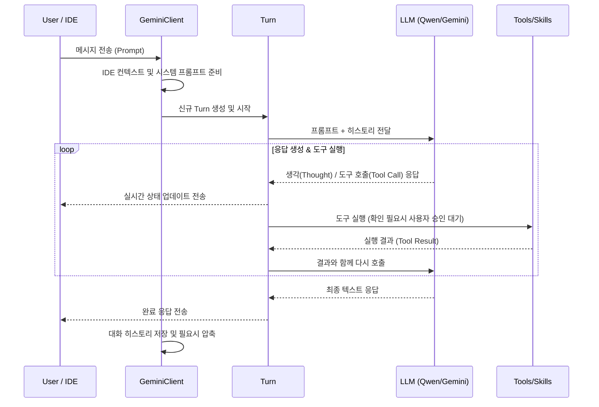

# Qwen Code 프로젝트 분석 리포트 (agent.md)

이 문서는 `qwen-code` 프로젝트의 구조, 기능 및 기술 스택에 대한 상세 분석 내용을 담고 있습니다.

## 1. 프로젝트 개요

**Qwen Code**는 터미널 환경에서 동작하는 오픈소스 AI 에이전트입니다. [Qwen/Qwen3-Coder](https://github.com/QwenLM/Qwen3-Coder) 모델에 최적화되어 있으며, 개발자가 대규모 코드베이스를 이해하고, 반복적인 작업을 자동화하며, 개발 속도를 높일 수 있도록 돕습니다.

Google의 Gemini CLI 기술을 기반으로 하고 있으나, Qwen-Coder 모델의 특성에 맞게 파서 및 연동 로직이 튜닝되어 있습니다.

## 2. 주요 기능

- **에이전틱 워크플로우 (Agentic Workflow)**: Skills, SubAgents, Plan Mode 등의 고도화된 기능을 통해 복잡한 작업을 자율적으로 수행합니다.
- **다양한 연동 모드**:
  - **대화형 모드 (Interactive Mode)**: 터미널 UI를 통한 실시간 대화 및 코드 편집.
  - **헤드리스 모드 (Headless Mode)**: 스크립트 기반 자동화 및 CI/CD 연동 (`qwen -p "질문"`).
  - **IDE 통합**: VS Code, Zed, JetBrains IDE 연동 지원.
- **인증 방식 지원**:
  - **Qwen OAuth**: `qwen.ai` 계정을 통한 무료 토큰(일일 2,000회 제한) 사용.
  - **OpenAI 호환 API**: API 키 및 커스텀 엔드포인트 설정 지원.
- **다국어 지원**: 한국어, 영어, 중국어, 일본어 등 다국어 문서 및 인터페이스 지원.

## 3. 프로젝트 구조 (Monorepo)

프로젝트는 `npm workspaces`를 사용하는 모노레포 구조로 되어 있습니다.

### 주요 패키지 (`/packages`)

- **`core`**: 에이전트의 핵심 로직, 모델 연동, 도구 실행 엔진 등이 포함된 핵심 라이브러리. (상세 내용 하단 참조)
- **`cli`**: 사용자가 터미널에서 사용하는 CLI 명령어 실체.
- **`sdk-typescript`**: 외부 애플리케이션에서 Qwen Code 기능을 사용할 수 있게 하는 SDK.
- **`sdk-java`**: 자바 환경을 위한 SDK.
- **`vscode-ide-companion`**: VS Code 확장 프로그램과의 통신 및 연동을 위한 컴패니언 레이어.
- **`test-utils`**: 테스트를 위한 공통 유틸리티.

---

## 5. Core 패키지 상세 분석 (`packages/core`)

`core` 패키지는 Qwen Code의 두뇌 역할을 하며, 다음과 같은 주요 컴포넌트로 구성됩니다.

### 5.1 주요 컴포넌트 및 역할

#### 1. GeminiClient (`src/core/client.ts`)

에이전트의 전체 생명주기를 관리하는 메인 컨트롤러입니다.

- **세션 관리**: 대화 기록(History)의 유지, 압축(Compression), 복원 수행.
- **컨텍스트 주입**: 현재 작업 디렉토리 정보 및 IDE(VS Code 등)의 편집 상태(활성 파일, 커서 위치 등)를 모델에 전달.
- **루프 탐지**: 에이전트가 무한 루프에 빠지는 것을 방지하는 `LoopDetectionService` 연동.
- **인증 및 폴백**: API 키 또는 OAuth 인증 상태를 관리하고, 필요 시 대체 모델로의 폴백(`handleFallback`) 수행.

#### 2. Turn (`src/core/turn.ts`)

사용자의 한 번의 입력에 대해 모델이 응답하고 도구를 실행하는 단일 "턴(Turn)" 단위를 관리합니다.

- **응답 파싱**: 모델의 출력에서 텍스트 응답, 생각(Thought), 도구 실행 요청(Tool Call)을 분리.
- **이벤트 스트리밍**: `GeminiEventType`을 통해 상위 레이어(CLI, IDE)에 실시간 상태(콘텐츠 생성 중, 도구 실행 중 등)를 전달.
- **도구 실행 제어**: 도구 실행 전 사용자 승인(Confirmation)이 필요한지 확인하고 실행 결과(Tool Result)를 다시 모델에 전달.

#### 3. Tools 및 CoreToolScheduler (`src/tools/`, `src/core/coreToolScheduler.ts`)

에이전트가 실제로 시스템과 상호작용할 수 있게 해주는 기능들입니다.

- **내장 도구**: 파일 읽기/쓰기, grep 검색, 셸 명령어 실행, 스마트 편집(Smart-edit) 등.
- **MCP(Model Context Protocol) 지원**: 외부 MCP 서버와의 연동을 통해 도구 세트를 동적으로 확장.
- **스케줄러**: 여러 도구 호출이 발생했을 때 순차적으로 실행하고 결과를 취합.

#### 4. Models 및 ContentGenerator (`src/models/`, `src/core/contentGenerator.ts`)

다양한 LLM 프로바이더와의 통신 레이어입니다.

- **다중 모델 지원**: Qwen, Gemini, OpenAI, Anthropic 등 다양한 모델 규격 지원.
- **토큰 관리**: 현재 세션의 토큰 사용량을 계산하고 제한을 관리.

### 5.2 에이전트 동작 흐름 (Sequence Diagram)

---

## 6. 빌드 및 개발 프로세스

- **빌드**: `npm run build` 스크립트를 통해 전체 또는 특정 패키지 빌드.
- **테스트**: `npm test`를 통해 각 패키지의 단위 테스트 수행 및 `test:integration`으로 통합 테스트 수행.
- **번들링**: `esbuild`를 사용하여 CLI 배포를 위한 단일 파일 번들링 수행.

---

_작성일: 2026-01-17_
_작성자: Antigravity AI Agent_
